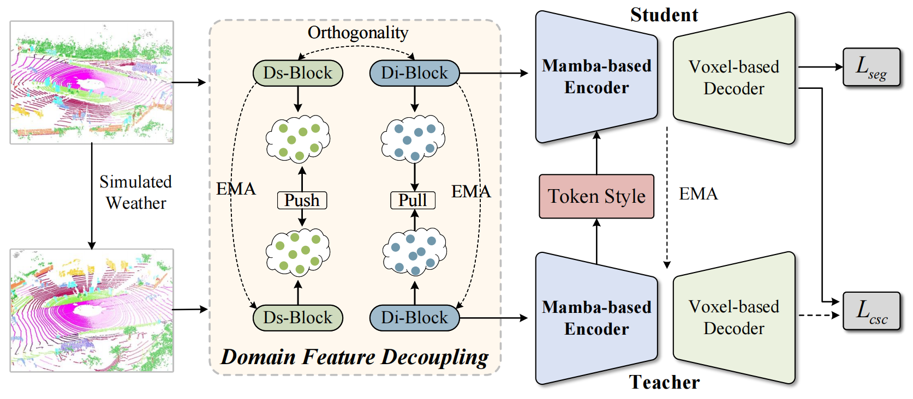
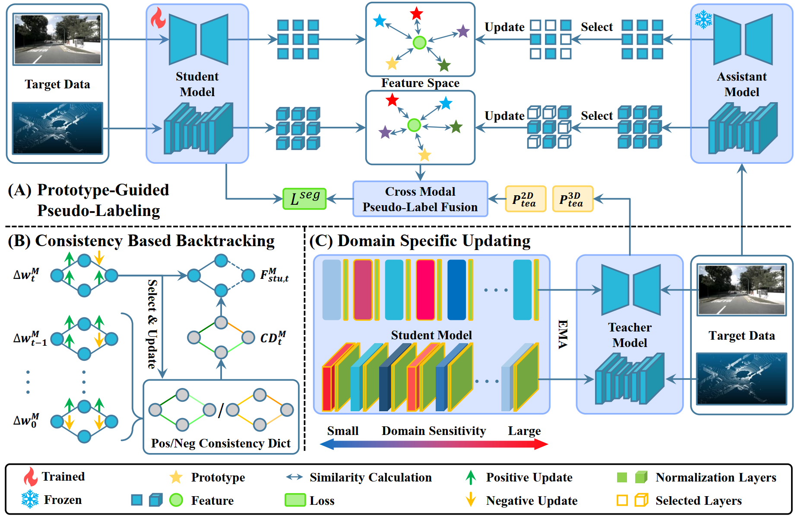
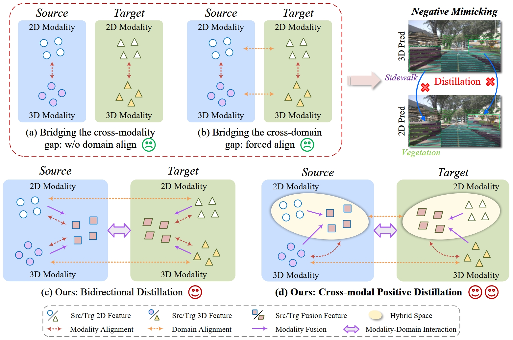
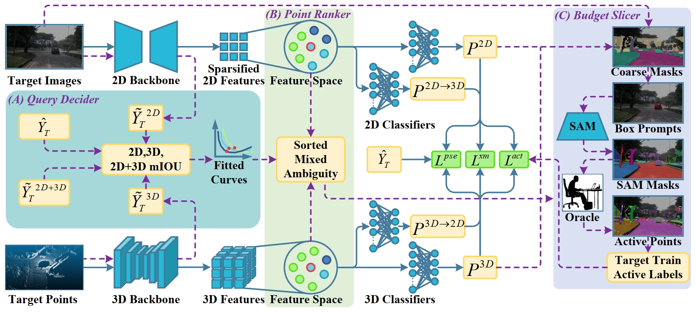
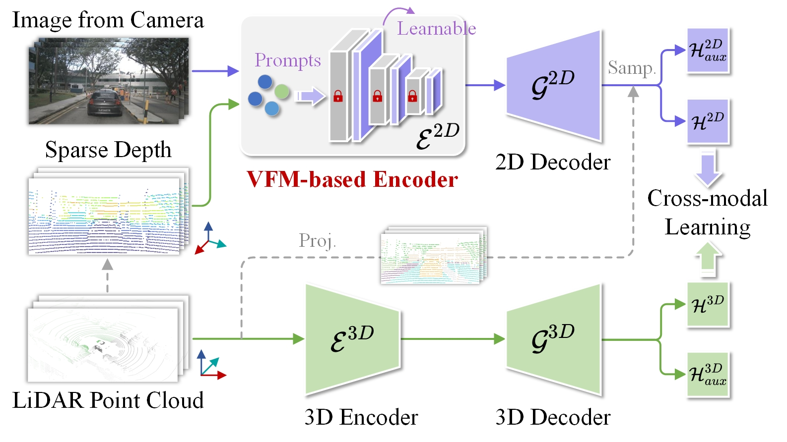
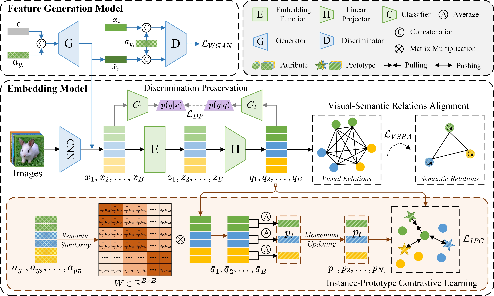
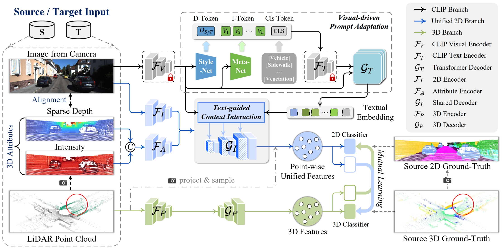
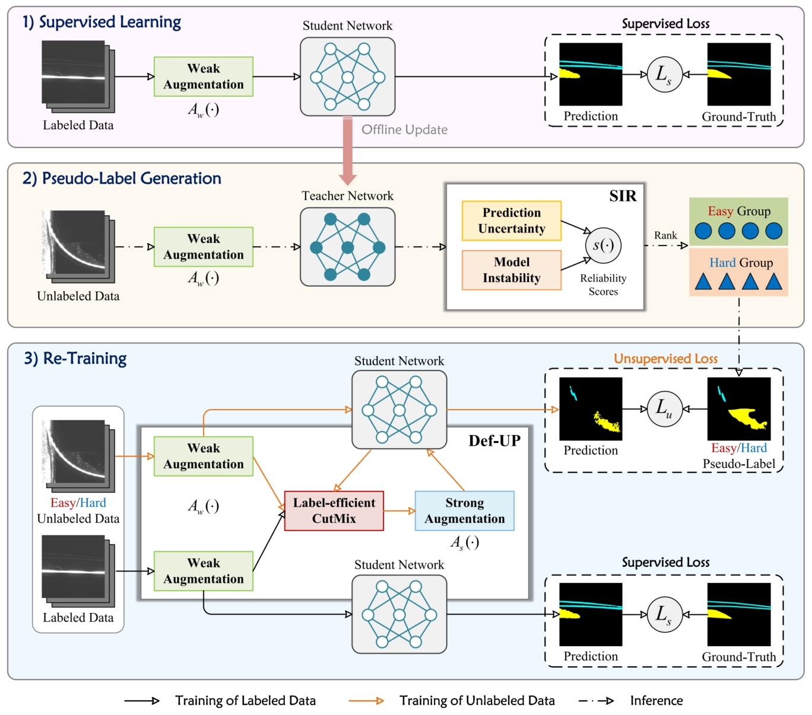
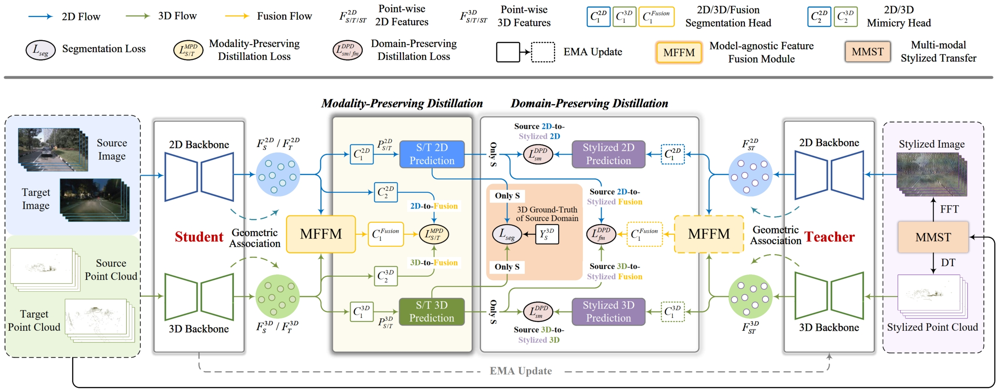

🌏 I work as a lecturer at the College of Computer and Data Science, Fuzhou University. I received the Ph.D. degree in the School of Informatics from Xiamen University, China, in 2025, supervised by Professor Yanyun Qu. I received the M.S. degree in the Department of Mechanical Engineering from Taiwan University, China, in 2019, supervised by Professor Han-Pang Huang.

📲 My research interests include, but are not limited to: Computer Vision (3D computer vision, image and point cloud semantic segmentation), Machine Learning (weakly-supervised learning, semi-supervised learning, unsupervised learning, transfer learning). Recently, I have focused on **3D domain adaptation, 3D domain generalization, and anomaly detection**. If you are interested in my research or have any use cases that you want to share, feel free to contact me! (📧: wuyao@fzu.edu.cn)

😆 I plan to admit 3 master students. 

_______________________________________________________________________________________________________
<h3>
   ✍News
</h3>

  <ul>
  <li> <strong>[Nov 2025]</strong> 🎉Two paper about cross-domain 3D semantic segmentation is accepted by <strong>AAAI 2026</strong>!</li>
  <li> <strong>[Jul 2025]</strong> 🎉One paper about multi-modal testing-time adaptation is accepted by <strong>ACMMM 2025</strong>!</li>
  <li> <strong>[May 2025]</strong> 🎉I successfully defended my PhD thesis!
  <li> <strong>[May 2025]</strong> 🎉One paper about unsupervised anomaly localization is accepted by <strong>TNNLS (IF: 10.4)</strong>!</li>
  <li> <strong>[Mar 2025]</strong> 🎉One paper about multi-modal unsupervised domain adaptation is accepted by <strong>ICME 2025</strong>!</li>
  <li> <strong>[Feb 2025]</strong> 🎉One paper about multi-modal unsupervised domain adaptation is accepted by <strong>TCSVT (IF: 11.1)</strong>!</li>
  <li> <strong>[Dec 2024]</strong> 🎉One paper about active source-free domain adaptation is accepted by <strong>AAAI 2025</strong>!</li>
  <li> <strong>[Oct 2024]</strong> 🎉One paper about generalized zero-shot learning is accepted by <strong>TCSVT (IF: 11.1)</strong>!</li>
  <li> <strong>[Sep 2024]</strong> 🎉One paper about unified cross-domain 3D semantic segmentation is accepted by <strong>NeurIPS 2024</strong>!</li>
  <li> <strong>[Jul 2024]</strong> 🎉One paper about multi-modal unsupervised domain adaptation is accepted by <strong>ACMMM 2024</strong>!</li>
  <li> <strong>[Apr 2024]</strong> 🎉One paper about few-shot anomaly classification is accepted by <strong>IJCAI 2024</strong>!</li>
  <li> <strong>[Oct 2023]</strong> 🎉One paper about semi-supervised defect segmentation is accepted by <strong>TNNLS (IF: 10.4)</strong>!</li>
  <li> <strong>[Jul 2023]</strong> 🎉One paper about multi-modal unsupervised domain adaptation is accepted by <strong>ACMMM 2023</strong>!</li>
  </ul>

_______________________________________________________________________________________________________

<h3>
   📚Selected Publications (1️⃣ Equal contribution, 📧 Corresponding author)
</h3>

        <table cellspacing="0" cellpadding="0" class="noBorder">
           <tbody>
            <tr>
                    <td class="noBorder" width="40%" align="center">
                        
                    </td>
                    <td>
                      <b>BeyondSparse: Facilitating Mamba to Enhance Cross-Domain 3D Semantic Segmentation in Adverse Weather </b>
                       
                      <strong>Yao Wu</strong>, Mingwei Xing, Yachao Zhang, Fangyong Wang, Xiaopei Zhang, Yanyun Qu. 
                       
                      <em>Annual AAAI Conference on Artificial Intelligence (AAAI 2026, CCF-A, Oral) </em>
                       
                      [<a href="">Paper</a>][<a href="https://github.com/Barcaaaa/BeyondSparse">Code is coming soon!</a>]
                    </td>
            </tr>
            <tr>
                    <td class="noBorder" width="40%" align="center">
                        
                    </td>
                    <td>
                      <b>PLATO-TTA: Prototype-Guided Pseudo-Labeling and Adaptive Tuning for Multi-Modal Test-Time Adaptation of 3D Segmentation </b>
                       
                      Jianxiang Xie, <strong>Yao Wu</strong>1️⃣, Yachao Zhang, Xiaopei Zhang, Yuan Xie, Yanyun Qu. 
                       
                      <em>ACM International Conference on Multimedia (ACMMM 2025, CCF-A) </em>
                       
                      [<a href="https://dl.acm.org/doi/10.1145/3746027.3755793">Paper</a>][<a href="">Code is coming soon!</a>]
                    </td>
            </tr>
            <tr>
                    <td class="noBorder" width="40%" align="center">
                        
                    </td>
                    <td>
                      <b>Fusion-then-Distillation: Toward Cross-modal Positive Distillation for Domain Adaptive 3D Semantic Segmentation </b>
                       
                      <strong>Yao Wu</strong>, Mingwei Xing, Yachao Zhang, Yuan Xie, Yanyun Qu. 
                       
                      <em>IEEE Transactions on Circuits and Systems for Video Technology (TCSVT 2025, JCR-Q1, CCF-B) </em>
                       
                      [<a href="https://ieeexplore.ieee.org/document/10904908">Paper</a>][<a href="https://github.com/Barcaaaa/FtD-PlusPlus">Code</a>]
                    </td>
            </tr>
            <tr>
                    <td class="noBorder" width="40%" align="center">
                        
                    </td>
                    <td>
                      <b>Omni-Query Active Learning for Source-Free Domain Adaptive Cross-Modality 3D Semantic Segmentation </b>
                       
                      Jianxiang Xie, <strong>Yao Wu</strong>1️⃣, Yachao Zhang, Zhongchao Shi, Jianping Fan, Yuan Xie, Yanyun Qu. 
                       
                      <em>Association for the Advancement of Artificial Intelligence (AAAI 2025, CCF-A) </em>
                       
                      [<a href="https://ojs.aaai.org/index.php/AAAI/article/view/32941">Paper</a>][<a href="https://github.com/Kylin-XJX/ActiveSFDA">Code</a>]
                    </td>
            </tr>
            <tr>
                    <td class="noBorder" width="40%" align="center">
                        
                    </td>
                    <td>
                      <b>UniDSeg: Unified Cross-Domain 3D Semantic Segmentation via Visual Foundation Models Prior </b>
                       
                      <strong>Yao Wu</strong>, Mingwei Xing, Yachao Zhang, Xiaotong Luo, Yuan Xie, Yanyun Qu. 
                       
                      <em>Annual Conference on Neural Information Processing Systems (NeurIPS 2024, CCF-A) </em>
                       
                      [<a href="https://neurips.cc/virtual/2024/poster/94354">Paper</a>][<a href="https://github.com/Barcaaaa/UniDSeg">Code</a>]
                    </td>
            </tr>
            <tr>
                    <td class="noBorder" width="40%" align="center">
                        
                    </td>
                    <td>
                      <b>RE-GZSL: Relation Extrapolation for Generalized Zero-Shot Learning </b>
                       
                      <strong>Yao Wu</strong>, Xia Kong, Yuan Xie, Yanyun Qu. 
                       
                      <em>IEEE Transactions on Circuits and Systems for Video Technology (TCSVT 2024, JCR-Q1, CCF-B) </em>
                       
                      [<a href="https://ieeexplore.ieee.org/document/10734386">Paper</a>][<a href="https://github.com/Barcaaaa/RE-GZSL">Code</a>]
                    </td>
            </tr>
            <tr>
                    <td class="noBorder" width="40%" align="center">
                        
                    </td>
                    <td>
                      <b>CLIP2UDA: Making Frozen CLIP Reward Unsupervised Domain Adaptation in 3D Semantic Segmentation </b>
                       
                      <strong>Yao Wu</strong>, Mingwei Xing, Yachao Zhang, Yuan Xie, Yanyun Qu. 
                       
                      <em>ACM International Conference on Multimedia (ACMMM 2024, CCF-A) </em>
                       
                      [<a href="https://openreview.net/forum?id=Ai1ziPxtmr&referrer=%5BAuthor%20Console%5D(%2Fgroup%3Fid%3Dacmmm.org%2FACMMM%2F2024%2FConference%2FAuthors%23your-submissions)">Paper</a>]
                    </td>
            </tr>
            <tr>
                    <td class="noBorder" width="40%" align="center">
                      

                        
                      

                    </td>
                    <td>
                      <b>CLIP-FSAC: Boosting CLIP for Few-Shot Anomaly Classification with Synthetic Anomalies </b>
                       
                      Zuo Zuo, <strong>Yao Wu</strong>1️⃣, Baoqiang Li, Jiahao Dong, You Zhou, Lei Zhou, Yanyun Qu, Zongze Wu. 
                       
                      <em>International Joint Conference on Artificial Intelligence (IJCAI 2024, CCF-A) </em>
                       
                      [<a href="https://www.ijcai.org/proceedings/2024/0203.pdf">Paper</a>][<a href="https://github.com/Jay-zzcoder/clip-fsac-pp">Code</a>]
                    </td>
            </tr>
            <tr>
                    <td class="noBorder" width="40%" align="center">
                        
                    </td>
                    <td>
                      <b>Perturbed Progressive Learning for Semisupervised Defect Segmentation </b>
                       
                      <strong>Yao Wu</strong>, Mingwei Xing, Yachao Zhang, Yuan Xie, Zongze Wu, Yanyun Qu. 
                       
                      <em>IEEE Transactions on Neural Networks and Learning Systems (TNNLS 2023, JCR-Q1, CCF-B) </em>
                       
                      [<a href="https://doi.org/10.1109/TNNLS.2023.3324188">Paper</a>][<a href="https://github.com/Barcaaaa/Perturbed-Progressive-Learning">Code</a>]
                    </td>
            </tr>
            <tr>
                    <td class="noBorder" width="40%" align="center">
                        
                    </td>
                    <td>
                      <b>Cross-modal Unsupervised Domain Adaptation for 3D Semantic Segmentation via Bidirectional Fusion-then-Distillation </b>
                       
                      <strong>Yao Wu</strong>, Mingwei Xing, Yachao Zhang, Jianping Fan, Zhongchao Shi, Yuan Xie, Yanyun Qu. 
                       
                      <em>ACM International Conference on Multimedia (ACMMM 2023, CCF-A, Oral) </em>
                       
                      [<a href="https://dl.acm.org/doi/10.1145/3581783.3612013">Paper</a>][<a href="https://github.com/Barcaaaa/BFtD-xMUDA">Code</a>]
                    </td>
             </tr>
          </tbody>
      </table>

[Please visit [my google scholar profile](https://scholar.google.com.hk/citations?user=QYbmS-YAAAAJ&hl=zh-CN) for the full publication list and [my github homepage](https://github.com/Barcaaaa) for recent works.]

_______________________________________________________________________________________________________

<h3>
   📠Academic Services
</h3>

  <ul>
  <li> <strong>Conference Reviewer</strong>: NeurIPS, CVPR, ICCV, ECCV, AAAI, ACMMM, ICME, ‌MMAsia </li>
  <li> <strong>Journal Reviewer</strong>: IEEE Transactions on Image Processing (TIP), IEEE Transactions on Neural Networks and Learning Systems (TNNLS), IEEE Transactions on Circuits and Systems for Video Technology (TCSVT), Expert Systems With Applications, NeuroComputing, Computer Vision and Image Understanding </li>
  </ul>

_______________________________________________________________________________________________________

<h3>
   ✨Hobby
</h3>

 <td width="30%">
 
</td>
   <td width="30%">
 
</td>
   <td width="30%">
 
</td>
   <td width="30%">
 
</td>

