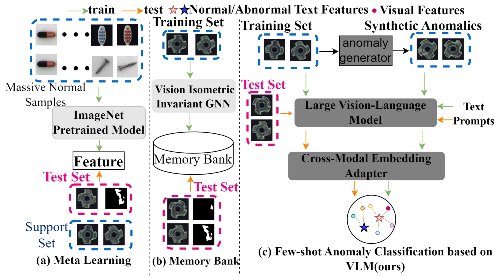

🌈 I am a Ph.D. student at the School of Informatics, at Xiamen University, China, supervised by Professor Yanyun Qu (曲延云教授). I received the M.S. degree in Department of Mechanical Engineering from Taiwan University, China, in 2019, supervised by Professor Han-Pang Huang (黄漢邦教授).

🏳️‍🌈 My research interests include, but are not limited to: **Computer Vision** (3D computer vision, image semantic segmentation, point cloud semantic segmentation), **Machine Learning** (weakly-supervised learning, semi-supervised learning, unsupervised learning, transfer learning). Recently, I have focused on 3D domain adaptation and 3D domain generalization. If you are interested in my research or have any use cases that you want to share, feel free to contact me!

_______________________________________________________________________________________________________
<h3>
   ✍News
</h3>

  <ul>
  <li> <strong>[Jul 2024]</strong> One paper about multi-modal unsupervised domain adaptation is accepted by ACMMM 2024!</li>
  <li> <strong>[Apr 2024]</strong> One paper about few-shot anomaly classification is accepted by IJCAI 2024!</li>
  <li> <strong>[Oct 2023]</strong> One paper about semi-supervised defect segmentation is accepted by TNNLS!</li>
  <li> <strong>[Aug 2023]</strong> One paper about Point Cloud Shape Analysis is accepted by PRCV 2023!</li>
  <li> <strong>[Jul 2023]</strong> One paper about multi-modal unsupervised domain adaptation is accepted by ACMMM 2023!</li>
  </ul>

_______________________________________________________________________________________________________

<h3>
   📚Selected Publications (1️⃣ Equal contribution, 📧 Corresponding author)
</h3>

        <table cellspacing="0" cellpadding="0" class="noBorder">
           <tbody>
            <tr>
                    <td class="noBorder" width="40%" align="center">
                        
                    </td>
                    <td>
                      <b>CLIP2UDA: Making Frozen CLIP Reward Unsupervised Domain Adaptation in 3D Semantic Segmentation </b>
                       
                      <strong>Yao Wu</strong>, Mingwei Xing, Yachao Zhang, Yuan Xie, Yanyun Qu. 
                       
                      <em>ACM International Conference on Multimedia (ACMMM 2024) </em>
                       
                      [<a href="https://openreview.net/forum?id=Ai1ziPxtmr&referrer=%5BAuthor%20Console%5D(%2Fgroup%3Fid%3Dacmmm.org%2FACMMM%2F2024%2FConference%2FAuthors%23your-submissions)">Paper</a>][<a href="https://github.com/Barcaaaa/CLIP2UDA">Code</a>]
                    </td>
            </tr>
            <tr>
                    <td class="noBorder" width="40%" align="center">
                      

                        
                      

                    </td>
                    <td>
                      <b>CLIP-FSAC: Boosting CLIP for Few-Shot Anomaly Classification with Synthetic Anomalies </b>
                       
                      Zuo Zuo, <strong>Yao Wu</strong>, Baoqiang Li, Jiahao Dong, You Zhou, Lei Zhou, Yanyun Qu, Zongze Wu. 
                       
                      <em>International Joint Conference on Artificial Intelligence (IJCAI 2024) </em>
                       
                      [<a href="https://www.ijcai.org/proceedings/2024/0203.pdf">Paper</a>][<a href="">Code</a>]
                    </td>
            </tr>
            <tr>
                    <td class="noBorder" width="40%" align="center">
                        
                    </td>
                    <td>
                      <b>Perturbed Progressive Learning for Semisupervised Defect Segmentation </b>
                       
                      <strong>Yao Wu</strong>, Mingwei Xing, Yachao Zhang, Yuan Xie, Zongze Wu, Yanyun Qu. 
                       
                      <em>IEEE Transactions on Neural Networks and Learning Systems (TNNLS 2023) </em>
                       
                      [<a href="https://doi.org/10.1109/TNNLS.2023.3324188">Paper</a>][<a href="https://github.com/Barcaaaa/Perturbed-Progressive-Learning">Code</a>]
                    </td>
            </tr>
            <tr>
                    <td class="noBorder" width="40%" align="center">
                        
                    </td>
                    <td>
                      <b>Cross-modal Unsupervised Domain Adaptation for 3D Semantic Segmentation via Bidirectional Fusion-then-Distillation </b>
                       
                      <strong>Yao Wu</strong>, Mingwei Xing, Yachao Zhang, Jianping Fan, Zhongchao Shi, Yuan Xie, Yanyun Qu. 
                       
                      <em>ACM International Conference on Multimedia (ACMMM 2023) </em>
                       
                      [<a href="https://dl.acm.org/doi/10.1145/3581783.3612013">Paper</a>][<a href="https://github.com/Barcaaaa/BFtD-xMUDA">Code</a>]
                    </td>
             </tr>
          </tbody>
      </table>

[Please visit [my google scholar profile](https://scholar.google.com.hk/citations?user=QYbmS-YAAAAJ&hl=zh-CN) for the full publication list and [my github homepage](https://github.com/Barcaaaa) for recent works.]
_______________________________________________________________________________________________________

<!--
<h3>
   📠Academic Services
</h3>

  <ul>
  <li> <strong>Conference Reviewer</strong>: CVPR, ICML, NeurIPS, AAAI, ICCV, ACMMM, ICLR </li>
  <li> <strong>Journal Reviewer</strong>: IEEE Transactions on Neural Networks and Learning Systems, IEEE Transactions on Intelligent Transportation Systems, IEEE Transactions on Artificial Intelligence, IEEE Transactions on Image Processing</li>
  </ul>

_______________________________________________________________________________________________________
-->

<h3>
   ✨Hobby
</h3>

 <td width="30%">
 
</td>
   <td width="30%">
 
</td>
   <td width="30%">
 
</td>
   <td width="30%">
 
</td>

